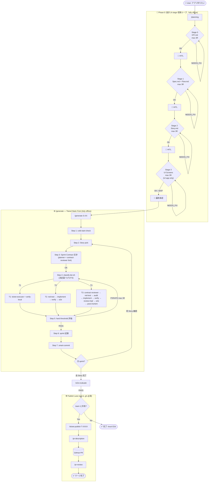

# agent-core

自律開発 harness for Claude Code。**H-Consensus (Tiered Static Fork)** モデルに基づく、KPI→Spec→Story→Sprint Contract の段階的設計と決定論 tier 分岐による fork ベース内側ループを提供します。

## 概要

`agent-core` は、AI エージェントに**役割ごとに独立したコンテキスト**で作業させることで、Self-Evaluation Bias（自己評価バイアス）を排除し、懐疑的な検証を強制する harness です。

設計の核心は 3 本柱:

1. **二重フィードバックループ**: generator (fork) と evaluator (fork) を物理的に分離し、harness blog の 20x 品質ゲインを回収する
2. **Tiered Static Fork**: Sprint Contract の metadata から決定論的に tier (T1/T2/T3) を判定し、fork 構成を sprint 開始時に静的確定
3. **Gotcha 2 層学習**: prompt 層 (agent/skill MD) + 構造層 (tier-matrix) の複利学習で時間経過とともに品質が向上

## 前提条件

- **Opus 4.6** — planner / spec-reviewer / flow-reviewer / acceptance-tester / contract-reviewer / post-mortem は opus を要求
- **Sandbox で動く** — 内側ループは完全オフライン (gh CLI 一切不要)、publish レーンのみ gh 依存

## インストール

```shell
/plugin marketplace add xmgrex/ccx-arsenal
/plugin install agent-core@ccx-arsenal
```

---

## Doc 階層と Pipeline

```
KPI.md      ── 成功定義 / 撤退条件 / Non-Goals         (Phase 0 Stage 0)
  ↓ HITL
Spec.md     ── Feature / User Story / AC              (Phase 0 Stage 1)
  ↓ HITL
Story.md    ── Value 単位 / Sprint 見積 / 依存 DAG    (Phase 0 Stage 2)
  ↓ HITL
[Screens]   ── HTML wireframes (UI アプリのみ)         (Phase 0 Stage 3)
  ↓ HITL
Sprint Contract (lazy, 1 sprint ずつ)                 (/generate Step 3)
  ↓
Ticket JSON ── .agent-core/tickets/T-XXXX.json
  ↓ classify-tier.sh (決定論)
T1 / T2 / T3 で fork 構成分岐
  ↓
Implementation (tier-specific fork chain)
  ↓
Hard threshold Evaluation (acceptance-tester fork)
  ↓
Sprint record + Gotcha extraction (post-mortem fork)
```

## Tier Matrix (決定論判定)

| Tier | 判定ルール | Fork 構成 | 対象例 |
|------|----------|----------|--------|
| **T1 低** | verifiability=exec AND risk_layer ∈ {doc, rename, config} AND surface ≤ 3 | ticket-executor + verify-local (2 fork) | typo, rename, config 変更 |
| **T2 中** | 上記以外かつ risk_layer ∉ {auth, db, api, migration, security} かつ surface < 10 | tester(red) → implementer → tester(verify) → acceptance-tester (4 fork) | feature 追加, bug fix, UI 変更 |
| **T3 高** | risk_layer ∈ {auth, db, api, migration, security} OR surface ≥ 10 | contract-reviewer + tester(red) + test-auditor + implementer + tester(verify) + reviewer + acceptance-tester + post-mortem (7-8 fork) | auth 変更, db schema, migration, API contract |

**全 tier 不可侵**:
- test-writer (tester fork via red-test) ≠ implementer (fork via implement)
- evaluator (acceptance-tester fork) ≠ generator

**コールドスタート保護**: post-mortem 10 件 **or** sprint 20 件の閾値に達するまで、全 sprint を強制 T2 で実行。`scripts/cold-start-check.sh` が判定。

---

## ワークフロー全体図



**Local-first 設計**: 内側ループは完全オフライン動作 (`.agent-core/tickets/`, `.agent-core/sprints/`, `.agent-core/gotchas/` がローカル権威)。GitHub 連携は **opt-in publish レーン**のみ。

---

## Skills 一覧

### Core Workflow (新フロー)

| Skill | 役割 | Next |
|-------|------|------|
| `/planning` | **起点** — KPI/Spec/Story/(Screens) の 4 stage 収束ループ、各 max 3 round | → `/generate` |
| `/generate` | **内側ループ orchestrator** — Sprint Contract 交渉 + tier 判定 + tier 別 fork 実行 + sprint 記録 + loop | → `/e2e-evaluate` or 次 sprint |
| `/e2e-evaluate` | 外側ループ evaluator (全機能完了後) | → `/ticket-publish` (opt-in) |
| `/plan-review` | スタンドアロン版 Phase 0 レビュー (収束ループなし) | → 手動判断 |
| `/tier-matrix-review` | **3 ヶ月周期** の構造層 Gotcha 学習 HITL レビュー | → tier 判定ルール改定 |

### Deprecated (1.3.0+、後方互換のみ)

| Skill | 役割 | 代替 |
|-------|------|------|
| `/create-ticket` | ⚠️ Spec から Phase 1 Feature を eager 一括生成 | `/generate` (lazy) |
| `/tdd-cycle` | ⚠️ RED-GREEN-REFACTOR 単発 | `/generate` の T2 分岐 |
| `/ticket-cycle` | ⚠️ AC 駆動実装 (非 TDD) | `/generate` の T1 分岐 |

### Atomic Fork Skills (`/generate` から内部的に呼ばれる)

| Skill | fork 先 | 用途 |
|-------|---------|------|
| `/red-test` | tester | テスト作成 & RED 確認 |
| `/audit-tests` | test-auditor | AC カバレッジ + 報酬ハック検出 |
| `/implement` | implementer | テストを通す最小実装 |
| `/verify-test` | tester | テスト実行 & GREEN/FAIL |
| `/review-impl` | reviewer | コードレビュー (T3 のみ) |
| `/e2e-evaluate` | acceptance-tester | E2E + デザイン評価 |

### 補助 Skills

| Skill | 用途 |
|-------|------|
| `/verify-local` | ビルド・テスト・lint 検証ゲート (stack auto-detect) |
| `/smart-commit` | 検証済みコミット作成 (Ticket/Sprint trailer) |
| `/investigate` | 構造化デバッグワークフロー |
| `/ticket-publish` | opt-in で ticket を GitHub Issue 化 |
| `/pr-description` | PR 自動生成 (Ticket trailer から関連チケット解決) |
| `/pr-review` | PR コードレビュー投稿 |

---

## Agents 一覧

| Agent | Model | 役割 | 呼ばれ方 |
|-------|-------|------|---------|
| `planner` | opus | KPI / Spec / Story を Mode 分岐で生成 / Revise Mode で差分修正 | `/planning` |
| `spec-reviewer` | opus | Mode 分岐で KPI/Spec/Story をレビュー (read-only) | `/planning` |
| `flow-reviewer` | opus | Spec Mode で画面 DAG、Story Mode で Story 依存 DAG をレビュー (read-only) | `/planning` |
| `ui-designer` | opus | HTML screens 生成 (layout-only、装飾禁止) | `/planning` Stage 3 |
| `ui-design-reviewer` | opus | HTML 評価 + 決定論ゲート (read-only) | `/planning` Stage 3 |
| **`contract-reviewer`** | opus | **(新)** Sprint Contract 検証 (atomicity / AC testability / Story 前進性 / tier metadata / KPI alignment) | `/generate` Step 3 |
| `tester` | sonnet | テスト作成・実行 (フォーク context で red-test と verify-test 別実行) | `/red-test`, `/verify-test` |
| `test-auditor` | opus | テスト品質監査 (報酬ハック検出、read-only) | `/audit-tests` |
| `implementer` | sonnet | テストを通すソースコード実装 (テスト変更禁止) | `/implement` |
| `ticket-executor` | opus | T1 用 AC 駆動実装 (削除・リファクタ・config) | `/generate` T1 分岐 |
| `reviewer` | opus | コードレビュー (T3 のみ、read-only) | `/review-impl` |
| `acceptance-tester` | opus | E2E + デザイン 4 軸評価 + Negative Testing | `/e2e-evaluate` |
| **`post-mortem`** | opus | **(新)** sprint PASS 後に Gotcha 抽出、sha1 hash dedup で Layer 1 に append | `/generate` Step 5 T3 |

---

## 典型的な使用例

### パターン1: ゼロからアプリを作る (H-Consensus フロー)

```shell
# 0. 設計 — KPI → Spec → Story → (Screens) の 4 stage 収束
/planning "タスク管理アプリを作りたい"

# 1. 最初の Story を実装 (Sprint Contract 交渉 → tier 判定 → 実装 → 評価)
/generate S-01

# 2. 同じ Story の次 sprint、または別 Story
/generate              # 引数なしで自動選択
/generate S-02         # 明示指定

# 3. dry-run で Sprint Contract と tier 判定だけ確認したい時
/generate S-03 --dry-run

# 4. 全 Story 完了後の E2E 評価
/e2e-evaluate

# === ここまで fully offline ===

# 5. (opt-in) team に共有
/ticket-publish T-0001
/pr-description
/pr-review
```

### パターン2: 旧フロー (既存プロジェクト)

既存の `.agent-core/tickets/T-XXXX.json` を持つプロジェクトは `/tdd-cycle` / `/ticket-cycle` が deprecated alias として動作します (1.3.0+)。新規プロジェクトへの移行は漸進的に。

```shell
# 旧フローは引き続き動く
/create-ticket          # Spec eager 一括生成
/tdd-cycle T-0001       # 従来 TDD レーン
/ticket-cycle T-0002    # 従来 非TDDレーン
```

### パターン3: 3 ヶ月毎の構造層 Gotcha レビュー

```shell
# sprint が 10 件以上蓄積された後に実行
/tier-matrix-review
# → 実績から tier 判定ルールの改定案を提示 → HITL 承認で適用
```

---

## 設計思想

### 二重フィードバックループ (harness blog 準拠)

`/generate` は planner / generator / evaluator の 3 役を物理的な fork 境界で分離します (Anthropic blog で 20x 品質ゲインが実証された構成)。

- **Contract 交渉**: planner(Contract Mode) ↔ contract-reviewer (両方 fork)
- **実装**: test-writer (tester fork) ≠ implementer (implementer fork) ← **TDD の物理的分離**
- **評価**: evaluator (acceptance-tester fork) ≠ generator ← **skeptical 評価の物理的分離**

### Tiered Static Fork (H-Consensus)

fork 構成を sprint 中に動的変更せず、**sprint 開始時の tier 判定で静的確定**します。

- **決定論判定**: `classify-tier.sh` が stdout で tier を出力、LLM 改変禁止
- **コールドスタート**: 初期 20 sprint or post-mortem 10 件までは強制 T2
- **tier 改定**: 3 ヶ月周期の `/tier-matrix-review` で HITL 承認 → 適用

詳細は [Tier Matrix](#tier-matrix-決定論判定) を参照。

### Gotcha 2 層学習

- **Layer 1 (prompt 層)**: 全 agent/skill MD 末尾の `## Gotchas` セクション。post-mortem agent が sprint PASS 直後に sha1 8 桁 hash 完全一致で dedup し append
- **Layer 2 (構造層)**: `.agent-core/tier-matrix.md` + `classify-tier.sh`。3 ヶ月周期で `/tier-matrix-review` が HITL 承認で更新

Gotcha entry format:
```
- [HASH8] [YYYY-MM-DD] <事象>: <対処> (hits: N, source: T-XXXX)
```

### Anti-Bias Rules (全評価者に埋め込み)

- 「動いているから OK」と判断しない
- 疑わしきは FAIL / NEEDS_FIX
- 問題を見つけることが仕事 (褒めるモードに入らない)
- エビデンスなき判定は許さない

### 決定論ゲート (`!` 構文)

重要な連鎖ステップは `!command` で機械実行し、Claude の判断スキップを防ぎます。`/generate` の tier 判定や cold-start 判定は全て `!` 構文で shell script 出力を context 注入し、LLM 改変を禁止しています。

---

## 変更履歴 (1.3.0)

### 新規追加
- **`/generate`** skill (H-Consensus Tiered Static Fork orchestrator)
- **`/tier-matrix-review`** skill (3 ヶ月周期構造層 Gotcha HITL レビュー)
- **`contract-reviewer`** agent (Sprint Contract 検証)
- **`post-mortem`** agent (Gotcha 抽出、Allowed Write Paths 制約付き)
- **`scripts/classify-tier.sh`** (決定論 tier 判定)
- **`scripts/cold-start-check.sh`** (閾値判定)
- 全 agent/skill MD に `## Gotchas` セクション追加

### 変更
- `/planning` を **4 stage 化** (KPI → Spec → Story → UI)、HITL ゲート 3-4 箇所
- `planner` agent に **KPI Mode / Spec Mode / Story Mode** prompt 分岐
- `spec-reviewer` / `flow-reviewer` に **Story Mode** 追加

### Deprecated (後方互換のため存置)
- `/create-ticket` (eager 生成、新フローは `/generate` の lazy)
- `/tdd-cycle` (単発 TDD、新フローは `/generate` T2 分岐)
- `/ticket-cycle` (非 TDD 単発、新フローは `/generate` T1 分岐)

---

## 詳細ドキュメント

開発ガイドラインは [CLAUDE.md](./CLAUDE.md) を参照してください。

## 関連資料

- [Anthropic: Harness Design for Long-Running Apps](https://www.anthropic.com/engineering/harness-design-long-running-apps) — 3 役 (planner/generator/evaluator) で 20x 品質ゲインの実証
