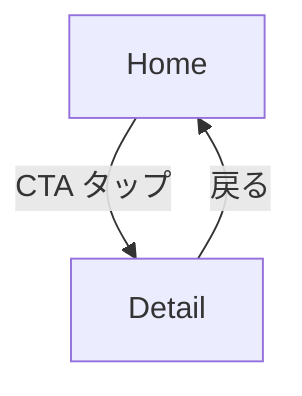

# /uiux-prototype — 1 文 brief から HTML プロトタイプを生成する kill-spawn ループ

あなたは **orchestrator** である。uiux-designer と uiux-evaluator を fork / kill-spawn しながら HTML プロトタイプを収束させる。

**核心設計**:
- 出力は **分割 HTML（index.html + styles.css + screens/*.html）+ Tailwind CDN**（最小構成）
- evaluator は **毎ラウンド kill-and-spawn**（前ラウンド context は一切持ち込まない）
- max 15 ラウンド、収束しなければユーザーエスカレーション
- 全イテレーションを `.uiux-lab/{run-id}/iter-{N}/` に保全（履歴の可視化）

**ARGUMENTS**: `$ARGUMENTS` は 1 文の brief（例: "社内の有給休暇申請を 30 秒で終わらせる LP"）。空なら AskUserQuestion で訊く。

---

## 参照根拠

本スキルは以下 4 本の第一原理 research に依拠する（designer / evaluator にも強制読込）：

- `${CLAUDE_PLUGIN_ROOT}/references/00-beautiful-ui-principles.md`
- `${CLAUDE_PLUGIN_ROOT}/references/01-ai-ui-anti-patterns.md`
- `${CLAUDE_PLUGIN_ROOT}/references/02-generator-verifier-separation.md`
- `${CLAUDE_PLUGIN_ROOT}/references/03-llm-prompt-efficacy.md`

orchestrator（あなた）は Step 1 ヒアリング時に references/01 と 00 を**斜め読みしてから**質問設計する。質問テンプレを暗記しない。

---

## Workflow

```
Step 0: ディレクトリ初期化 / resume check
Step 1: ヒアリング (AskUserQuestion) → Visual Thesis / Content Plan / Interaction Thesis 確定
Step 2: brief.md + flow.md を main が Write
Step 3: iter-1 designer fork → HTML 生成
Step 4: evaluator kill-spawn fork → 評価
Step 5: 判定分岐
   OK → Step 7
   NEEDS_FIX → Step 6
Step 6: Revise Mode designer fork → iter-{N+1} 生成 → Step 4 へ戻る (max 15R)
Step 7: HITL (ユーザー最終確認)
```

---

## Step 0 — 初期化 / Resume Check

```bash
# run-id を生成（slug + timestamp）
SLUG=$(echo "$ARGUMENTS" | head -c 40 | tr -c 'a-zA-Z0-9' '-' | tr 'A-Z' 'a-z' | sed 's/-*$//;s/^-*//')
RUN_ID="${SLUG:-unnamed}-$(date +%Y%m%d-%H%M)"
RUN_DIR=".uiux-lab/${RUN_ID}"
mkdir -p "$RUN_DIR"
echo "RUN_ID=$RUN_ID"
echo "RUN_DIR=$RUN_DIR"
```

`.uiux-lab/` が既に存在し直近の未完了 run があれば、ユーザーに `resume` か `new run` を AskUserQuestion で確認。

---

## Step 1 — ヒアリング（AskUserQuestion）

1 文 brief を**真空状態で飲み込まない**。references/01 Root cause 3「prompt vacuum」を踏まえ、以下 3 項目を確定する（OpenAI GPT-5 frontend 記事の 3 テーゼに対応）：

### ヒアリング項目（AskUserQuestion 1 回で束ねる）

| # | 質問 | 目的 |
|---|------|------|
| 1 | **Visual thesis** — このプロダクトの mood/material/energy を 1 文で？（例: "90s ドイツ工業デザインの禁欲的精度" / "夜更かし中の本屋の温かみ"） | accent / typography の方向性決定 |
| 2 | **Accent color 制約** — 非 blue / 非 purple で想起する色はあるか？（なければ orchestrator が提案） | AI-slop 防止（references/01 Root cause 1） |
| 3 | **Core interaction** — 画面の中で**最も重要な 1 つの動作**は？ | 1 セクション 1 仕事原則のアンカー |
| 4 | **Target screens** — 画面は何枚必要？（1-5 が推奨、6+ は最小構成を超える） | flow.md のノード数確定 |
| 5 | **Anti-reference** — 「これだけは避けたい」UI/サイトがあれば教えてほしい（SaaS ダッシュボード、bento grid 等） | 禁止リスト先出し |

**ヒアリングのスキップ条件**: ARGUMENTS が既に上記 3 テーゼを含む長文ブリーフならヒアリング省略可。ただし AI-slop 防止のため accent 色だけは確認する。

---

## Step 2 — brief.md + flow.md を Write

ヒアリング結果を統合して 2 ファイル作成。

### brief.md

```markdown
# Brief: {App Name}

## One-liner
{ARGUMENTS の 1 文}

## Visual Thesis
{ヒアリング #1}

## Accent Color
{ヒアリング #2（non-blue / non-purple）}

## Core Interaction
{ヒアリング #3}

## Target Screens
{ヒアリング #4 の数字とリスト}

## Anti-references
- {ヒアリング #5 の列挙}
- 共通禁止: blue/indigo/violet/sky/purple 系色、generic SaaS card grid, bento sprawl, pill soup, logo cloud
```

### flow.md

```markdown
# Flow: {App Name}

## Screens



## Screen list
- home: {1 文説明}
- detail: {1 文説明}
...
```

最小構成では画面 1-3 枚で十分。6 枚以上必要ならユーザーに「まず 3 枚で prototype、後から拡張」を提案。

---

## Step 3 — uiux-designer fork (Initial Mode)

Agent tool を subagent_type=uiux-designer で fork：

```
Delegating to uiux-designer (Initial Mode)

BRIEF_PATH: [絶対パス].uiux-lab/{run-id}/brief.md
FLOW_PATH: [絶対パス].uiux-lab/{run-id}/flow.md
OUT_DIR: [絶対パス].uiux-lab/{run-id}/iter-1/
IS_REVISE_MODE: false

まず references/* 全 4 本を Read し、Aesthetic Stance 3 点を宣言してから以下を生成せよ:
- $OUT_DIR/index.html（目次 + スタンス宣言 + 全画面リンク）
- $OUT_DIR/styles.css（共通 CSS 変数、accent OKLCH 5 shades）
- $OUT_DIR/screens/{screen-id}.html（flow.md の全画面分）

出力完了後、アウトプット（宣言 / ファイルリスト / 自己チェック）を返せ。
```

designer の成果物を受け取ったら Step 4 へ。

---

## Step 4 — uiux-evaluator kill-spawn（Visual-first）

**重要**: 各ラウンド `Agent(subagent_type=uiux-evaluator)` を**新規 fork**する。前ラウンドの evaluator instance は使い回さない（references/02 Principle 3「認知的別モード」）。

### Step 4-pre: agent-browser sandbox 許可の確認（abort on deny、P0 #3）

evaluator は `agent-browser` CLI を Bash 経由で呼び、全画面のスクショを撮って**画像として視覚評価する**。agent-browser は `~/.agent-browser` に socket を作るため、**sandbox が有効だとエラー**になる。

決定論ゲート（`!` 構文で事前実行）:

```bash
!if ! agent-browser --help >/dev/null 2>&1; then
  echo "ABORT: agent-browser が利用できません（sandbox 不許可 or 未インストール）"
  echo "settings の allowWrite に /Users/$USER/.agent-browser/** を追加してください"
  exit 1
fi
```

**Text-Only Mode は削除しました**。視覚評価無しの OK 判定は references/01 Root cause 4「視覚 feedback loop の欠如」を構造的に踏襲するため、不許可なら skill を abort し、設定修正を促す。逃げ道は塞ぐ。

### Step 4-main: evaluator spawn

evaluator へのプロンプトは**最小限**：

```
ITER_DIR: [絶対パス].uiux-lab/{run-id}/iter-{N}/
BRIEF_PATH: [絶対パス].uiux-lab/{run-id}/brief.md
FLOW_PATH: [絶対パス].uiux-lab/{run-id}/flow.md
SCREENSHOTS_DIR: [絶対パス].uiux-lab/{run-id}/iter-{N}/screenshots/
ROUND: N / 15

references/* 全 4 本を Read し、Visual Capture Step（ITER_DIR 配下の全 HTML を agent-browser で撮影 → Read で画像読込）→ 機械検証 → 8 軸評価で OK / NEEDS_FIX を返せ。
iter-{N-1} 以前のファイルは絶対に Read するな。手元の ITER_DIR とスクショのみを見ろ。
```

**禁止**:
- 前ラウンドの review.md を evaluator プロンプトに含めない
- 「前回より良くなったか」を問わない（絶対評価のみ）
- 「designer の意図」を推測させない

評価結果を `.uiux-lab/{run-id}/iter-{N}/review.md` に Write。スクショは `.uiux-lab/{run-id}/iter-{N}/screenshots/*.png` に保全（全ラウンド履歴）。

---

## Step 5 — 判定分岐（Hard Threshold + 下限ラウンド、P0 #1 #2 #4）

### Step 5-1: Hard Threshold 判定（決定論ゲート）

evaluator が書いた `.uiux-lab/{run-id}/iter-{N}/review.md` から複数の信号を機械抽出し、**一致検証 + Hard Threshold 判定**する。evaluator の self-report だけでなく Issues セクションの実カウントも取って突合する（Goodhart 対策）：

```bash
!REVIEW=".uiux-lab/{run-id}/iter-{N}/review.md"

# evaluator の self-report
HARD_OK_SELFREPORT=$(grep -oE 'Hard_OK:\s*(YES|NO)' "$REVIEW" | head -1 | awk '{print $2}')
CRITICAL_SELFREPORT=$(grep -oE 'Critical_count:\s*[0-9]+' "$REVIEW" | head -1 | awk '{print $2}')
IMPORTANT_SELFREPORT=$(grep -oE 'Important_count:\s*[0-9]+' "$REVIEW" | head -1 | awk '{print $2}')
VISUAL_STATUS=$(grep -oE 'Visual_Capture_status:\s*(PASSED|FAILED)' "$REVIEW" | head -1 | awk '{print $2}')
STANCE_STATUS=$(grep -oE 'Aesthetic_Stance_declaration:\s*(PRESENT|MISSING)' "$REVIEW" | head -1 | awk '{print $2}')

# Issues セクションの実カウント
CRITICAL_ACTUAL=$(grep -cE '^\s*[0-9]+\.\s*\*\*\[Critical\]\*\*' "$REVIEW")
IMPORTANT_ACTUAL=$(grep -cE '^\s*[0-9]+\.\s*\*\*\[Important\]\*\*' "$REVIEW")

# 一致検証 (Goodhart 対策)
if [ "$CRITICAL_SELFREPORT" != "$CRITICAL_ACTUAL" ] || [ "$IMPORTANT_SELFREPORT" != "$IMPORTANT_ACTUAL" ]; then
  echo "SELFREPORT_MISMATCH: evaluator の数値宣言と Issues カウントが不一致 → 自動 NEEDS_FIX"
  HARD_OK=0
elif [ "$HARD_OK_SELFREPORT" = "YES" ] && [ "$CRITICAL_ACTUAL" -eq 0 ] && [ "$IMPORTANT_ACTUAL" -le 2 ] && [ "$VISUAL_STATUS" = "PASSED" ] && [ "$STANCE_STATUS" = "PRESENT" ]; then
  HARD_OK=1
else
  HARD_OK=0
fi

echo "HARD_OK=$HARD_OK (C=$CRITICAL_ACTUAL, I=$IMPORTANT_ACTUAL, V=$VISUAL_STATUS, S=$STANCE_STATUS)"
```

- `HARD_OK=0` なら即 NEEDS_FIX 扱い → Step 6 へ
- `HARD_OK=1` なら Step 5-2 へ

### Step 5-2: 下限ラウンドゲート（MIN_ROUND=3）

```bash
!MIN_ROUND=3
if [ "$HARD_OK" = "1" ] && [ "$ROUND" -lt "$MIN_ROUND" ]; then
  echo "EARLY_OK_REJECTED: ROUND=$ROUND < MIN_ROUND=$MIN_ROUND"
  echo "下限未満の OK は自動 NEEDS_FIX に書き換え"
  FORCE_NEEDS_FIX=1
else
  FORCE_NEEDS_FIX=0
fi
```

- `FORCE_NEEDS_FIX=1` なら Step 6 へ（designer に「評価が厳しすぎない可能性。Important 指摘を Critical に昇格する視点で見直して」と伝える）

### Step 5-3: セカンドオピニオン強制発動（R1-R3 のみ）

R1-R3 の HARD_OK=1 は**必ず 2 回目 evaluator を spawn** して独立判定：

```bash
!if [ "$HARD_OK" = "1" ] && [ "$ROUND" -le 3 ]; then
  echo "SECOND_OPINION_REQUIRED=1"
else
  echo "SECOND_OPINION_REQUIRED=0"
fi
```

- `SECOND_OPINION_REQUIRED=1` のとき、orchestrator は evaluator を**再度 kill-spawn**し、独立評価を受ける。結果を `.uiux-lab/{run-id}/iter-{N}/review-2nd.md` に Write
- 2 回目も Hard Threshold を通過したら真の OK → Step 7
- どちらか一方でも Hard Threshold 未通過なら NEEDS_FIX → Step 6

### Step 5-4: 最終判定サマリ

```
ROUND=N, HARD_OK_1=?, (SECOND_OPINION=?, HARD_OK_2=?), FINAL=OK/NEEDS_FIX
```

全判定ログを `.uiux-lab/{run-id}/iter-{N}/judgment.log` に Write（後の plateau 分析用）。

---

## Step 6 — Revise ループ

```
ROUND = ROUND + 1
if ROUND > 15:
  ユーザーエスカレーション
  （全ラウンドの review.md を要約して提示、続行 / 中止 / brief 再検討を AskUserQuestion）

PREV_DIR = .uiux-lab/{run-id}/iter-{N-1}/
OUT_DIR  = .uiux-lab/{run-id}/iter-{N}/
FIX_INSTRUCTIONS = iter-{N-1}/review.md の "Fix Instructions" セクション

Agent(subagent_type=uiux-designer) fork (Revise Mode):
  PREV_DIR, OUT_DIR, FIX_INSTRUCTIONS を渡す
  designer は PREV_DIR を OUT_DIR に cp -R で複製してから、
  FIX_INSTRUCTIONS が指すファイルのみ Edit する（触らないファイルは byte-identical）
  references を毎回 Read し直させる（前ラウンド記憶に頼らせない）
```

designer の revise 完了後 Step 4 へ。

---

## Step 7 — HITL（ユーザー最終確認）

```markdown
## UIUX Prototype Run Complete

- Run ID: {run-id}
- Final iteration: iter-{N}
- Rounds used: N / 15
- Final HTML: .uiux-lab/{run-id}/iter-{N}/index.html

### Aesthetic Stance (final)
- Visual thesis: ...
- Accent: ...
- Interaction: ...

### Open in browser:
  open .uiux-lab/{run-id}/iter-{N}/index.html

### 次のアクション候補:
1. そのまま採用 → 実装フェーズへ
2. 追加ヒアリング → 新しい run として /uiux-prototype を再実行
3. 微修正 → Fix Instructions を指示して再度 evaluator を回す
4. アーカイブ → 全 iter-* ファイルを `.uiux-lab/archive/` へ移動

旦那様、どういたしましょうか？
```

---

## ファイル配置まとめ

```
.uiux-lab/
└── {run-id}/
    ├── brief.md
    ├── flow.md
    ├── iter-1/
    │   ├── index.html               ← 目次 + Aesthetic Stance 宣言
    │   ├── styles.css               ← 共通 CSS 変数
    │   ├── screens/
    │   │   ├── home.html
    │   │   ├── mood-log.html
    │   │   └── ...
    │   ├── review.md                ← evaluator のレポート
    │   └── screenshots/
    │       ├── index.png
    │       ├── screens__home.png
    │       ├── screens__home-mobile.png   (モバイル brief のとき)
    │       ├── screens__mood-log.png
    │       └── ...
    ├── iter-2/                      ← iter-1 を cp -R した後、差分ファイルのみ Edit
    │   ├── index.html
    │   ├── styles.css
    │   ├── screens/ ...
    │   ├── review.md
    │   └── screenshots/
    └── iter-N/ ...
```

全 iter-* は**保全**（designer は Revise 時に `cp -R PREV_DIR OUT_DIR` してから差分 Edit）。履歴を遡って design 判断の変遷を学習できる。触らなかったファイルは byte-identical のまま iter-N に残り、`diff iter-{N-1} iter-{N}` で実際の変更箇所が明確になる。

---

## 不変条件 (非交渉)

- **evaluator は毎ラウンド kill-and-spawn** — 例外なし
- **前ラウンド review を evaluator に渡さない** — バイアス遮断
- **references は毎ラウンド両 agent が Read し直す** — 記憶に頼らない
- **全 iter-* を保全** — 上書き禁止
- **MIN_ROUND=3 下限** — 3 ラウンド未満の OK は自動 NEEDS_FIX に書き換え（P0 #1）
- **max 15 ラウンド** — 超過は HITL エスカレーション
- **Hard Threshold 決定論ゲート** — `Critical==0 && Important<=2 && Visual_Capture_count>=1` を Bash で機械判定、LLM 判断を挟まない（P0 #4）
- **セカンドオピニオン強制発動** — R1-R3 の Hard OK は必ず 2 回目 evaluator を kill-spawn、両方 OK でなければ NEEDS_FIX（P0 #2）
- **出力は分割 HTML + styles.css + Tailwind CDN** — React/Vue 等フレームワーク禁止、Phase 2 で拡張
- **Revise は cp -R + 差分 Edit** — ゼロ再生成禁止、触らないファイルは byte-identical
- **Visual Capture 必須、Text-Only Mode 削除** — agent-browser が使えない環境では skill を abort、設定修正を促す（P0 #3）

---

## エスカレーション

Step 6 で ROUND > 15 になった場合：

```markdown
## Convergence Failure — Round 15 exhausted

Run ID: {run-id}
全ラウンドの判定:
- iter-1: NEEDS_FIX ([Critical の件数] critical)
- iter-2: NEEDS_FIX ...
- ...

共通の未解決問題（評価軸別集計）:
- Navigation: N 回指摘
- Whitespace: N 回指摘
- AI-slop: N 回指摘
...

**推定 root cause**（orchestrator の分析、確信度 low）:
{複数ラウンドで同じ指摘が残るなら、brief が不足している可能性が高い}

**選択肢**:
A. ヒアリング項目を再設計して新規 run
B. 現状の iter-15 を "不完全だが素材として採用" する
C. 中止
```

---

## Gotchas

<!-- Format: - [HASH8] [YYYY-MM-DD] <event>: <action> (hits: N, source: run-id) -->
